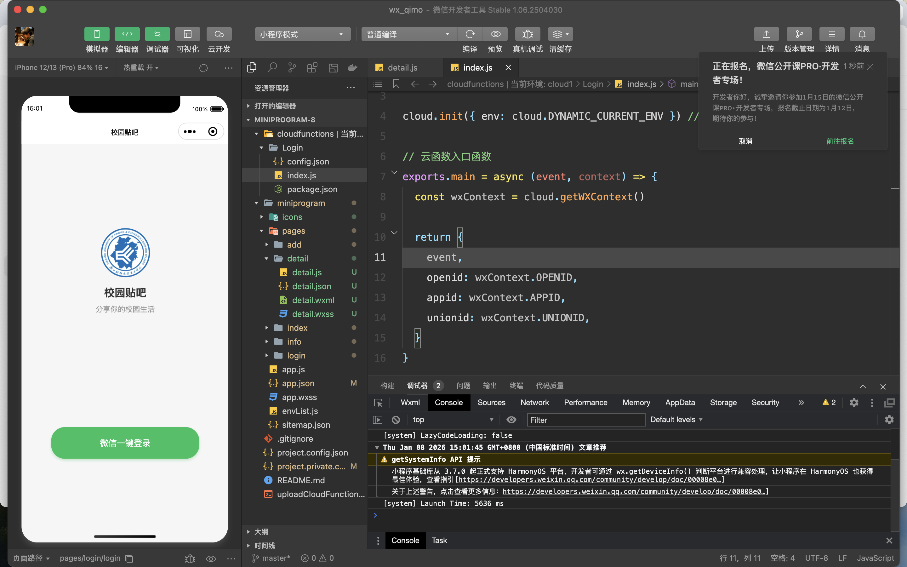
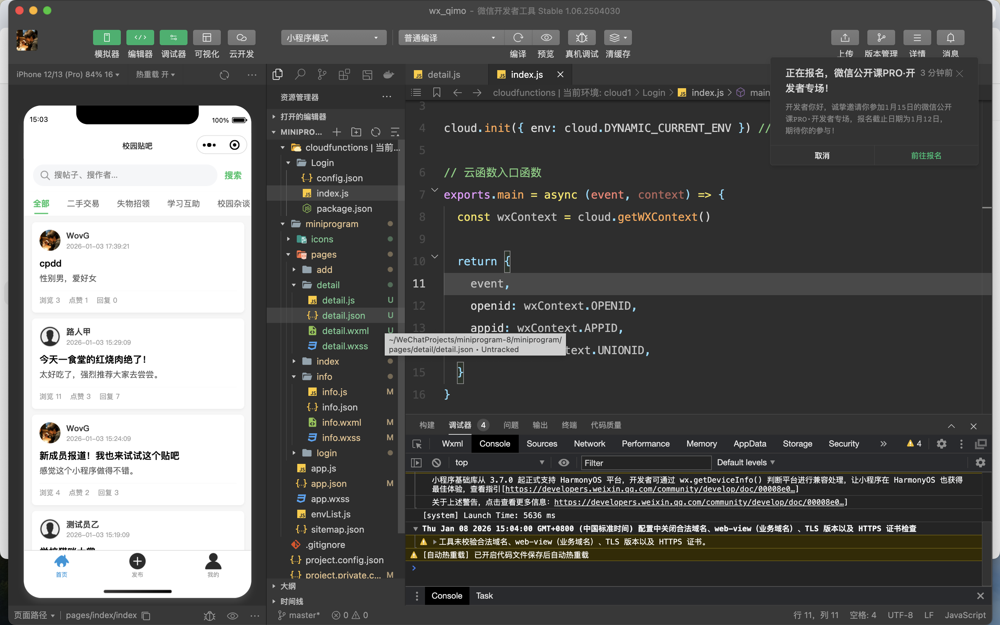
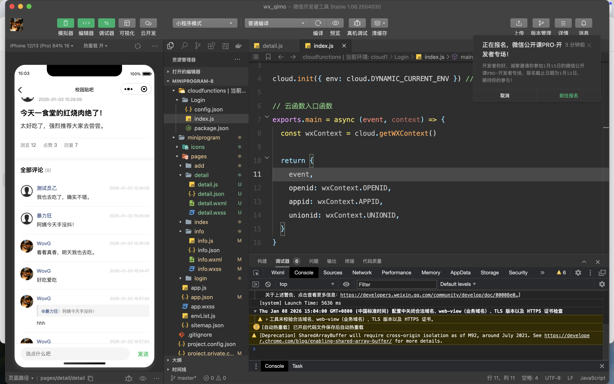
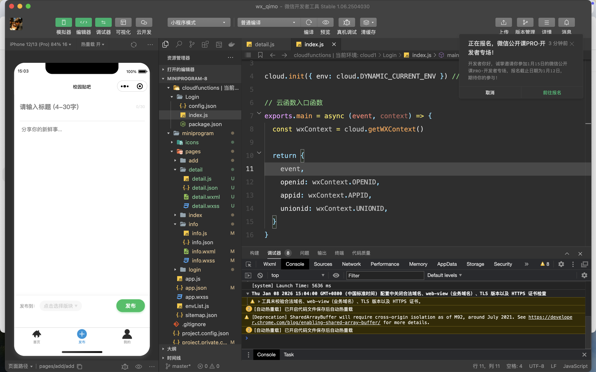
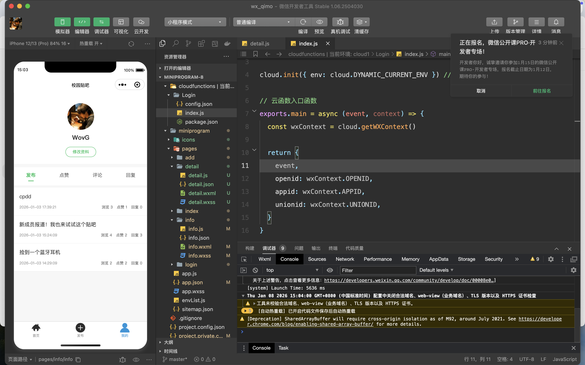

# 微信小程序-校园贴吧后端服务
基于 Spring Boot + MyBatis-Plus 开发的轻量级后端系统，为校园贴吧类微信小程序提供全流程业务支撑，覆盖用户管理、帖子互动、评论回复、分类管理等核心场景，具备高可维护性和数据一致性保障。
## 核心信息
| 项目         | 说明                                                              |
|--------------|-----------------------------------------------------------------|
| 技术栈       | Java、Spring Boot 2.x、MyBatis-Plus、MySQL 8.0+、RESTful API、Lombok |
| 开发环境     | JDK 17+、Maven 3.6+、IntelliJ IDEA、Git                            |
| 运行端口     | 8083                                                            |
| 数据库       | MySQL（数据库名：wx）                                                  |
| 核心特性     | 事务一致性保障、全局统一响应格式、防重复操作、分层架构设计                                   |
## 核心功能模块
### 1. 用户模块
- 基于微信 openId 实现免注册登录，自动完成新用户创建/老用户匹配
- 个人中心数据聚合：支持我的帖子、我的点赞、我的评论、收到的回复等数据查询
- 提供用户昵称、头像等基础信息修改接口

### 2. 帖子模块
- 多维度查询：支持关键词搜索、分类筛选获取帖子列表，详情页自动统计阅读量
- 互动能力：实现帖子点赞（防重复点赞）、发布功能，保证数据一致性
- 个性化查询：支持我的帖子、我的点赞帖子等专属数据筛选

### 3. 评论模块
- 支持评论发布、楼中楼回复（父评论关联），发布评论自动同步帖子回复数
- 提供帖子评论列表、我的评论、收到的回复等多维度查询能力

### 4. 分类模块
- 提供全部分类查询接口，为帖子分类筛选、管理提供基础支撑

## 项目前端截图
### 1.登录页面

### 2.贴吧主页面（提供关键词、分类进行搜索）

### 3.贴子内容详情页（展示详细内容，包含点赞、回复等相应模块）

### 4.发布贴子

### 5.个人信息（可修改个人信息，展示个人点赞、回复等相关信息）

